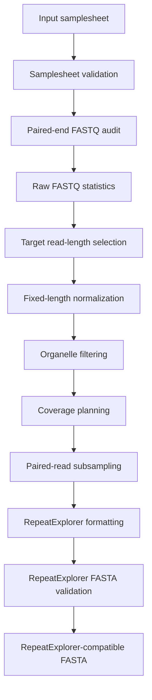

# REPEXPREP

## Overview

REPEXPREP is a Nextflow DSL2 pipeline for preprocessing paired-end
whole-genome sequencing reads for repeatome analysis with RepeatExplorer2.

The pipeline validates the input samplesheet, audits paired-end FASTQ
files, calculates raw-read statistics, normalizes read length, removes
read pairs matching organelle reference sequences, plans coverage-based
subsampling, samples paired reads reproducibly, and generates validated
RepeatExplorer2-compatible FASTA files.



## Current status

REPEXPREP is currently under active development.

The current pipeline baseline has been tested:

- locally using four subsampled *Carex* datasets;
- on the MetaCentrum PBS Pro computing infrastructure;
- with organelle-read filtering enabled;
- using paired-end compressed FASTQ input.

The corresponding functional baseline is tagged as:

```text
baseline-local-hpc-orgfilter-2026-07-20
```

This tag represents a functional development baseline, not a stable
public release.

## Workflow overview

1. Validate the input samplesheet.
2. Audit paired-end FASTQ files.
3. Calculate raw FASTQ statistics.
4. Determine the target read length.
5. Normalize paired reads to a fixed length.
6. Filter read pairs matching organelle references.
7. Calculate the required low-pass sampling depth.
8. Subsample paired-end reads reproducibly.
9. Interleave, rename, and convert the selected reads.
10. Export and validate RepeatExplorer2-compatible FASTA files.

## Main processing stages

| Stage | Purpose | Main output |
|---|---|---|
| Samplesheet validation | Checks input columns, metadata, and file paths | `samplesheet.validated.csv` |
| Paired-end read audit | Verifies consistency between R1 and R2 files | `${meta.id}.pair_audit.tsv` |
| Raw FASTQ statistics | Records basic properties of the input reads | `${meta.id}.raw_fastq_stats.tsv` |
| Target read-length selection | Determines the normalization length | `${sample_id}.target_length.tsv` |
| Fixed-length normalization | Crops paired reads to a common length | `${meta.id}_R*.fixed.fastq.gz` |
| Organelle filtering | Removes read pairs matching organelle references | `*_R*.organelle_filtered.fastq.gz` |
| Coverage planning | Calculates the required number of read pairs | `${sample_id}.coverage_plan.tsv` |
| Paired-read subsampling | Samples reads according to the coverage plan | `${meta.id}_R*.sampled.fastq.gz` |
| RepeatExplorer formatting | Converts paired reads into a RepeatExplorer2-compatible FASTA file | `${meta.id}.repex.fasta` |
| FASTA validation | Checks the structure of the final FASTA file | `${meta.id}.repex_validation.tsv` |

## Preliminary requirements

The pipeline currently requires:

- Nextflow;
- Java 17 or a compatible Java version;
- Python 3;
- the command-line software required by the individual pipeline processes;
- access to a PBS Pro scheduler when using the MetaCentrum profile.

The local `test` profile currently uses software available directly in
the local environment. Container support has not yet been finalized.

## Input information

The pipeline accepts a comma-separated samplesheet in CSV format.

Example:

```csv
sample,fastq_1,fastq_2,organism,genome_size_bp,ploidy,organelle_fasta,target_coverage,target_read_length
SRR38519255_Carex_boryana,data/sample_R1.fastq.gz,data/sample_R2.fastq.gz,Carex_boryana,1350000000,2,org_reference/combined/carex_combined_orgs.fasta,0.001,
```

Relative paths are recommended when the same samplesheet is intended to
be used on different systems.

## Samplesheet columns

| Column | Required | Description |
|---|---:|---|
| `sample` | Yes | Unique sample identifier |
| `fastq_1` | Yes | Path to the R1 FASTQ file |
| `fastq_2` | Yes | Path to the R2 FASTQ file |
| `organism` | No | Organism name |
| `genome_size_bp` | Required for coverage planning | Estimated haploid genome size in base pairs |
| `ploidy` | Required for coverage planning | Expected ploidy level |
| `organelle_fasta` | Required when organelle filtering is enabled | FASTA file containing chloroplast, mitochondrial, or combined organelle reference sequences |
| `target_coverage` | Required for coverage-based sampling | Requested genome coverage |
| `target_read_length` | No | Explicit normalized read length; it may be determined automatically when empty |

## Quick start

Run all commands from the root directory of the pipeline repository.

### Local test execution

```bash
nextflow run . \
    -profile test \
    --input samplesheets/validated/local_test_subsample_portable.orgfix.validated.csv \
    --outdir results/local_test_organelle_filter_test_2
```

### Resume a local execution

Resume an interrupted or previously cached execution with:

```bash
nextflow run . \
    -profile test \
    --input samplesheets/validated/local_test_subsample_portable.orgfix.validated.csv \
    --outdir results/local_test_organelle_filter_test_2 \
    -resume
```

### MetaCentrum test execution

After logging in to MetaCentrum, load an available Nextflow module:

```bash
module avail nextflow/
module add nextflow
nextflow -version
```

Run the pipeline with the MetaCentrum profile:

```bash
nextflow run . \
    -profile metacentrum \
    --input samplesheets/local_test_subsample_metacentrum.csv \
    --outdir results/metacentrum_organelle_filter_test
```

### Resume a MetaCentrum execution

```bash
nextflow run . \
    -profile metacentrum \
    --input samplesheets/local_test_subsample_metacentrum.csv \
    --outdir results/metacentrum_organelle_filter_test \
    -resume
```

## Main parameters

| Parameter | Description |
|---|---|
| `--input` | Path to the input samplesheet |
| `--outdir` | Output directory |
| `--skip_organelle_filter` | Skip organelle filtering when set to `true` |
| `--help` | Display the pipeline help message |

Additional parameters are defined in:

```text
nextflow_schema.json
```

## Organelle references

Small organelle reference FASTA files used during development are stored
under:

```text
org_reference/
```

The current combined references include:

- *Arabidopsis thaliana*, used as a model dicot reference;
- *Oryza sativa*, used as a model monocot reference;
- *Carex*, represented by *Carex agglomerata* chloroplast sequences and
  *Carex breviculmis* mitochondrial sequences.

The provenance, accession numbers, and construction of the combined
reference files still require complete documentation.

## Output structure

```text
results/
├── pipeline_info/
│   └── samplesheet.validated.csv
├── raw_qc/
│   ├── pair_audit/
│   └── fastq_stats/
├── length_normalization/
│   ├── target_length/
│   ├── cropped_reads/
│   └── reports/
├── organelle_filter/
│   ├── fastq/
│   └── reports/
├── coverage_sampling/
│   ├── plans/
│   ├── sampled_reads/
│   └── reports/
└── repex/
    ├── fasta/
    ├── reports/
    └── validation/
```

The principal final output is:

```text
${params.outdir}/repex/fasta/*.repex.fasta
```

## Development warning and known limitations

- The pipeline is under active development.
- Parameters, interfaces, and output structure may change before the
  first stable release.
- Container support has not yet been finalized.
- Testing has so far focused on four subsampled *Carex* datasets.
- The full dataset has not yet been used for systematic performance
  benchmarking.
- Organelle-reference provenance still requires complete documentation.
- The pipeline is not yet fully compliant with nf-core guidelines.

## Planned developments

Planned developments include:

- direct downloading of sequencing data from NCBI or ENA;
- reproducible container support;
- testing with the complete dataset;
- improved automated testing;
- progressive alignment with nf-core guidelines.

## Documentation

Baseline execution records, software versions, reference-sample
inventories, and input/output documentation are stored in:

```text
docs/baseline/
```

## Citation

Citation information is provided in:

```text
CITATIONS.md
```

When using REPEXPREP, please cite Nextflow, RepeatExplorer2, and the
software executed by the individual pipeline modules.

## License

License information is provided in:

```text
LICENSE
```