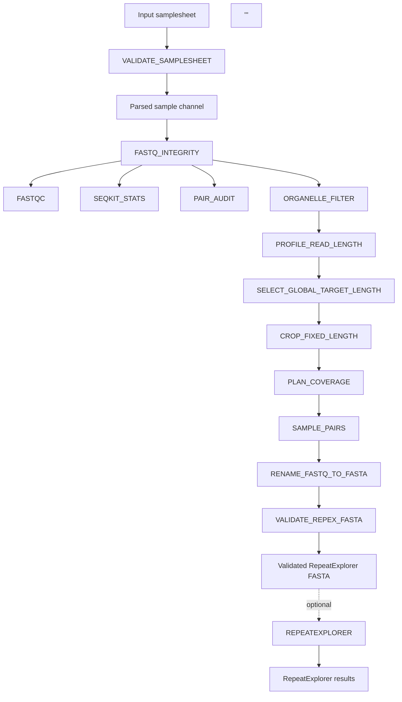

# REPEXPREP

## Overview

REPEXPREP is a Nextflow DSL2 pipeline for preprocessing paired-end
whole-genome sequencing reads for repeatome analysis with RepeatExplorer2.

The pipeline validates a local-input samplesheet, verifies FASTQ integrity and paired-read synchronisation, performs sequencing quality control, removes read pairs matching organelle reference sequences, normalizes read length, plans coverage-based subsampling relative to the haploid 1C genome size, samples paired reads reproducibly, and generates validated RepeatExplorer2-compatible FASTA files.

RepeatExplorer2 analysis can optionally be launched directly from the validated FASTA output when running in a supported environment



## Current status

REPEXPREP is in final stabilization prior to release tagging.

### Stable `main` branch

The `main`branch contains the supported preprocessing workflow and defines the stable execution contract of REPEXPREP.

The current workflow supports
- local paired-end FASTQ input provided through a samplesheet;
- FASTQ structural integrity checks;
- FASTQC and SeqKit-based sequencing quality control;
- paired-read synchronisation auditing;
- optional organelle-read filtering;
- dataset-wide read-length normalization;
- deterministic coverage-based paired-read subsampling;
- RepeatExplorer2-compatible FASTA generation;
- final validation of RepeatExplorer-formatted FASTA files;
- optional RepeatExplorer2 execution in supported environments.

Regarding read-length normalization, two dataset-wide modes are currently supported:
- `global_auto`: determines one target read length automatically for the complete dataset.
- `global_fixed`: applies one user-supplied target read length to all samples.

The per_sample strategy has not been implemented yet in the supported stable workflow.

Coverage planning is based on the **haploid 1C genome size**. The per-sample `genome_size_1C_bp` value is used directly as the effective genome size for coverage calculations. Ploidy is retained as required biological metadata and does *not* multiply the genome size used for coverage planning.

The stable workflow has been functionally validated:
- on local Linux using Docker;
- on the MetaCentrum PBS Pro infrastructure using Singularity;
- with paired-end compressed FASTQ input;
- with organelle-read filtering enabled;
- with both `global_auto` and `global_fixed` read-length normalization;
- with deterministic coverage-based sampling;
- with final RepeatExplorer FASTA validation;
- with successful RepeatExplorer2 execution on MetaCentrum;
- with successful Nextflow cache reuse using `-resume`.

The validated execution baseline uses Nextflow 26.04.4 or later.

### Experimental branch

The `experimental/input-acquisition` branch extends REPEXPREP with a unified input-acquisition layer for local and remotely archived paired-end sequencing reads.

The implemented experimental functionality includes:

- unified samplesheet handling for local FASTQ files and sequencing-run accessions;
- support for `SRR`, `ERR`, and `DRR` run accessions;
- explicit remote-provider selection through `ena` or `ncbi_sra`;
- automatic provider resolution through `provider = auto`;
- direct paired-end FASTQ acquisition from ENA;
- integrity checking of ENA downloads using repository-provided MD5 checksums;
- NCBI SRA acquisition using SRA Toolkit `prefetch` and `fasterq-dump`;
- materialization of local and remotely acquired reads into a common paired-read interface for downstream preprocessing;
- per-sample input-provenance reporting;
- remote-provider resolution reports and acquisition manifests;
- validation of mixed local and accession-based input configurations.

The acquisition layer is designed so that downstream preprocessing operates on the same paired-read interface regardless of whether the reads were supplied locally or obtained from a public archive.

This functionality has undergone dedicated development and smoke testing, **but it is not part of the stable main execution contract**. The experimental branch has not yet undergone the complete regression, container-parity, MetaCentrum, and release-freeze validation applied to main.

Remote input acquisition may therefore still change before eventual integration into the stable workflow.

### Archived development branch

The `archive/process-implementation` branch preserves earlier process-level implementation work and development history. It is not intended for routine pipeline execution.

## Workflow overview

The stable `main` workflow consists of the following processing stages:

1. **Samplesheet validation**. Validate the input samplesheet, verify the required metadata fields, and resolve local FASTQ and reference-file paths. Module involved: `VALIDATE_SAMPLESHEET`.

2. **FASTQ integrity validation**. Verify that the paired-end FASTQ inputs are structurally valid and readable before downstream processing. Module involved: `FASTQ_INTEGRITY`.

3. **Initial sequencing quality control**. Characterize the input reads and verify paired-read consistency:
   - **FASTQ statistics**. Generate per-file sequence statistics using the nf-core `SEQKIT_STATS` module.
   - **Sequence quality assessment**. Generate per-file diagnostic quality reports using the nf-core `FASTQC` module.
   - **Paired-read audit**. Verify R1/R2 read counts, identifiers, ordering, and pairing consistency using `PAIR_AUDIT`.

4. **Organelle-read filtering**. Remove read pairs matching the supplied chloroplast and/or mitochondrial reference sequences while preserving paired-read synchronisation. Module involved: `ORGANELLE_FILTER`.

5. **Read-length profiling**. Characterize the read-length distribution of the organelle-filtered reads and generate the information required for dataset-wide target-length selection. Module involved: `PROFILE_READ_LENGTH`.

6. **Dataset-wide target-length selection**. Determine one target read length shared by all samples. In `global_auto` mode, the target is selected automatically from the observed read-length profiles; in `global_fixed` mode, a user-supplied target length is applied. Module involved: `SELECT_GLOBAL_TARGET_LENGTH`.

7. **Fixed-length cropping**. Crop paired reads to the selected dataset-wide target length while retaining only valid read pairs. Module involved: `CROP_FIXED_LENGTH`.

8. **Coverage planning**. Calculate the number of read pairs required to reach the requested sequencing coverage using the haploid 1C genome size, target coverage, and normalized read length. Ploidy is retained as biological metadata but does not modify the genome size used for coverage calculations. Module involved: `PLAN_COVERAGE`.

9. **Reproducible paired-read subsampling**. Subsample the required number of read pairs using a deterministic random seed while preserving R1/R2 synchronisation. Module involved: `SAMPLE_PAIRS`.

10. **RepeatExplorer2 input formatting**. Interleave sampled read pairs, convert FASTQ records to FASTA, and generate RepeatExplorer2-compatible sequence identifiers. Module involved: `RENAME_FASTQ_TO_FASTA`.

11. **Final RepeatExplorer2 FASTA validation**. Validate the generated FASTA against structural and paired-read requirements and produce the final acceptance report. Module involved: `VALIDATE_REPEX_FASTA`.

12. **Optional RepeatExplorer2 analysis**. When `--run_repeatexplorer true` is enabled in a supported execution environment, submit the validated FASTA to RepeatExplorer2 and publish the resulting clustering, annotation, and TAREAN outputs. Module involved: `REPEATEXPLORER`.

## Main processing stages

| Stage | Purpose | Main output |
|---|---|---|
| Samplesheet validation | Validates required metadata and resolves local input paths | `samplesheet.validated.csv` |
| FASTQ integrity validation | Verifies that input FASTQ files are readable and structurally valid | FASTQ integrity report |
| FASTQ quality control | Generates sequencing-quality diagnostics and basic read statistics | FastQC reports and SeqKit statistics |
| Paired-read audit | Verifies R1/R2 read counts, identifiers, ordering, and synchronisation | `${meta.id}.pair_audit.tsv` |
| Organelle filtering | Removes read pairs matching the supplied organelle reference sequences | `${meta.id}_R*.organelle_filtered.fastq.gz` and filtering report |
| Read-length profiling | Characterizes read-length distributions after organelle filtering | Read-length profile report |
| Dataset-wide target-length selection | Determines one target read length shared across all samples | Dataset-wide target-length report |
| Fixed-length normalization | Crops paired reads to the selected common read length | `${meta.id}_R*.fixed.fastq.gz` |
| Coverage planning | Calculates the required number of read pairs using haploid 1C genome size and target coverage | `${meta.id}.coverage_plan.tsv` |
| Paired-read subsampling | Samples paired reads reproducibly according to the coverage plan | `${meta.id}_R*.sampled.fastq.gz` |
| RepeatExplorer formatting | Converts sampled paired reads into RepeatExplorer2-compatible FASTA | `${meta.id}.repex.fasta` and formatting report |
| FASTA validation | Verifies structural and paired-read requirements of the final RepeatExplorer2 FASTA | `${meta.id}.repex_validation.tsv` |
| RepeatExplorer2 analysis *(optional)* | Runs RepeatExplorer2 on validated FASTA input when explicitly enabled | RepeatExplorer2 clustering, annotation, and TAREAN results |

## Architecture documentation

Detailed architecture documentation can be found in `docs/architecture`. For detailed process contracts, execution graph diagrams, component maintenance decisions, and intermediate file schemas, refer to the following specs:

- **Process Inventory:** `docs/architecture/process_inventory.tsv`is a machine-readable inventory of active pipeline processes, their inputs, outputs, and publication targets. Also, a human-readable version is available at `docs/architecture/process_inventory.md`.

- **Workflow Map:** `docs/architecture/workflow_map.md` describes the execution graph, process dependencies and data flow through the stable workflow

- **Component decisions:** `docs/architecture/component_decisions.tsv`. Records component-level maintenance, replacement, retention, and legacy decisions.

- **Samplesheet contract:** `docs/architecture/samplesheet_contract.md`. It defines the supported input fields, validation rules, and metadata requirements of the stable `main` workflow.

- **Target read-length decision:** `docs/architecture/ADR-001-target-read-length.md`. Records the architectural decision governing dataset-wide read-length normalization and the supported `global_auto` and `global_fixed` strategies.

- **Output contract:** `docs/architecture/output_contract.tsv`. Defines the expected published outputs and their role in the pipeline.

- **Repository layout:** `docs/architecture/repository_layout.md`. Describes the organization and responsibilities of the main repository directories.

Some files in `docs/architecture/` preserve pre-refactoring inventories or implementation checkpoints for development traceability. These historical files should not be interpreted as descriptions of the current stable workflow.

## Preliminary requirements

REPEXPREP requires Nextflow 26.04.4 or later and Java 17 or later.

The remaining software dependencies required by individual pipeline processes are provided through containerized execution and do not need to be installed manually on the host system.

### Local execution

The validated local execution environment requires:

- Nextflow 26.04.4 or later;
- Java 17 or later;
- Docker;
- sufficient local storage for the input FASTQ files, Nextflow work directory, and pipeline outputs.

Local containerized execution uses the combined `docker,local` profiles.

### MetaCentrum execution

The validated MetaCentrum execution environment requires:

- Nextflow 26.04.4 or later;
- Java 17 or later;
- access to the MetaCentrum PBS Pro scheduler;
- Singularity;
- access to the preprocessing container configured by the `metacentrum` profile;
- access to the RepeatExplorer2 Singularity image when optional RepeatExplorer2 execution is enabled.

The `metacentrum` profile configures PBS Pro execution and Singularity-based process isolation.

> **Important:** REPEXPREP has been validated with Nextflow 26.04.4. Older Nextflow installations, including the previously tested Nextflow 23.10.0 MetaCentrum module, are not supported by the current stable workflow.


## Input information

The stable `main` workflow local paired-end FASTQ accepts a comma-separated samplesheet in CSV format. Each row represents one biological sample and must define the paired R1 and R2 files together with the metadata required for read-length normalization and coverage-based subsampling.

Example:

```csv
sample,fastq_1,fastq_2,organism,genome_size_1C_bp,ploidy,organelle_fasta,target_coverage,target_read_length
SRR38519255_Carex_boryana,data/sample_R1.fastq.gz,data/sample_R2.fastq.gz,Carex_boryana,1350000000,2,org_reference/combined/carex_combined_orgs.fasta,0.001,
```

Relative paths are recommended when the same samplesheet is intended to be used on different execution environments.

> **Important:** The stable `main` branch accepts local FASTQ input only. Accession-based input and automatic acquisition from public sequencing repositories are implemented separately in the `experimental/input-acquisition` branch.

### Genome-size and ploidy semantics

Coverage planning is based on the haploid 1C genome size. The value supplied in `genome_size_1C_bp` is used directly as the effective genome size when calculating the number of read pairs required to reach the requested coverage.

`ploidy` is a required biological metadata field, but it does *not* multiply or otherwise modify `genome_size_1C_bp` during coverage planning.


## Samplesheet columns

| Column | Required | Description |
|---|---:|---|
| `sample` | Yes | Unique sample identifier |
| `fastq_1` | Yes | Path to the compressed paired-end R1 FASTQ file |
| `fastq_2` | Yes | Path to the compressed paired-end R2 FASTQ file |
| `organism` | No; optional | Organism or project-specific taxon label |
| `genome_size_1C_bp` | Yes | Haploid 1C genome size in base pairs. Used directly as the coverage-planning genome size. |
| `ploidy` | Yes | Biological ploidy level. **Must be a positive integer.** Retained as metadata and not used to scale the genome size for coverage calculations. |
| `organelle_fasta` | Conditional: Required if organelle filtering is enabled | Path to the organelle reference FASTA used for paired-read filtering. |
| `target_coverage` | Conditional | Desired sequencing coverage used for coverage-based subsampling. A per-sample value may be supplied here when not provided through the corresponding pipeline-level setting. |
| `target_read_length` | No: optional | Reserved read-length field. It must remain empty for the supported `global_auto` and `global_fixed` execution modes; dataset-wide target-length selection is controlled through pipeline parameters. Per-sample target-length selection is planned but is not currently implemented in the stable workflow. |

> **Planned functionality:** a `per_sample` target-length strategy is reserved for future development. It is not currently supported by the stable `main` workflow and samplesheet-level `target_read_length` values should therefore remain empty.

## Quick start

Run REPEXPREP from the root directory of the pipeline repository.

The examples below use the supported `global_auto` read-length normalization strategy and leave RepeatExplorer2 execution disabled. RepeatExplorer2 can be enabled separately after preprocessing has completed successfully.

### Local execution with Docker

Make sure that Nextflow 26.04.4 or later, Java 17 or later, and Docker are available:

```bash
nextflow -version
java -version
docker --version
```

Run the stable preprocessing workflow with:

```bash
nextflow run . \
    -profile docker,local \
    --input samplesheet.csv \
    --outdir results \
    --target_length_mode global_auto \
    --run_repeatexplorer false \
    --organelle_filter_container repexprep-tools:1.0.2
```
The local Docker image `repexprep-tools:1.0.2` must be available before execution.

Also, Nextflow can reuse successfully completed processes from a previous execution when the same work directory is retained:

```bash
nextflow run . \
    -profile docker,local \
    --input samplesheet.csv \
    --outdir results \
    --target_length_mode global_auto \
    --run_repeatexplorer false \
    --organelle_filter_container repexprep-tools:1.0.2 \
    -resume
```

### MetaCentrum execution

REPEXPREP has been validated on MetaCentrum using PBS Pro and Singularity.

Before running the pipeline, load Java 17 and make sure that a compatible installation is available:

```bash
module load openjdk/17

nextflow -version
java -version
singularity --version
```

Nextflow 26.04.4 or later is required. Do not assume that the default MetaCentrum Nextflow module provides a compatible version; always verify the reported version before launching the pipeline.

Run the preprocessing workflow with:

```bash
nextflow run . \
    -profile metacentrum \
    --input samplesheet.csv \
    --outdir results \
    --target_length_mode global_auto \
    --run_repeatexplorer false
```
The *metacentrum* profile configures PBS Pro execution and the required Singularity containers.

Reuse previously completed processes with:

```bash
nextflow run . \
    -profile metacentrum \
    --input samplesheet.csv \
    --outdir results \
    --target_length_mode global_auto \
    --run_repeatexplorer false \
    -resume
```
The same Nextflow work directory must remain available for cached processes to be reused.

### Fixed dataset-wide read length

To use a predefined common read length instead of automatic selection:

```bash
nextflow run . \
    -profile docker,local \
    --input samplesheet.csv \
    --outdir results \
    --target_length_mode global_fixed \
    --target_read_length 150 \
    --run_repeatexplorer false \
    --organelle_filter_container repexprep-tools:1.0.2
```
The supplied `--target_read_length` is applied to all samples in the dataset.


## Main parameters

| Parameter | Default | Description |
|---|---:|---|
| `--input` | Required | Path to the input CSV samplesheet. |
| `--outdir` | `results` | Directory in which pipeline outputs are published. |
| `--target_coverage` | None | Optional global target-coverage fallback. Per-sample values can be supplied through the samplesheet. |
| `--target_length_mode` | `global_auto` | Dataset-wide read-length strategy. Supported values are `global_auto` and `global_fixed`. |
| `--target_read_length` | None | Dataset-wide target read length. Required when `--target_length_mode global_fixed` is used. |
| `--min_retained_fraction` | `0.95` | Minimum desired fraction of complete read pairs retained during automatic target-length selection. |
| `--min_target_read_length` | `100` | Minimum allowed automatically selected target read length, in base pairs. |
| `--max_target_read_length` | `300` | Maximum allowed automatically selected target read length, in base pairs. |
| `--genome_size_1C_bp` | None | Optional global haploid 1C genome-size fallback. Per-sample values can be provided in the samplesheet. |
| `--sampling_seed` | `42` | Random seed used for deterministic paired-read subsampling. |
| `--skip_organelle_filter` | `false` | Skip organelle-read filtering when set to `true`. |
| `--run_repeatexplorer` | `false` | Run RepeatExplorer2 independently for each validated sample FASTA. |
| `--repeatexplorer_taxon` | `VIRIDIPLANTAE3.0` | RepeatExplorer2 taxonomic classification preset. |

Additional and advanced parameters are documented in `nextflow_schema.json` and `docs/usage.md`.

## Optional RepeatExplorer2 execution

RepeatExplorer2 execution is optional and disabled by default. The preprocessing workflow always generates and validates RepeatExplorer2-compatible FASTA files independently of whether RepeatExplorer2 analysis itself is requested.

>*Warning!* Only FASTA files that successfully pass `VALIDATE_REPEX_FASTA` are eligible for downstream RepeatExplorer2 execution. Further information available at *Data acceptance criterion* section below.

RepeatExplorer2 analysis can be enabled with:

```bash
--run_repeatexplorer true
```

The default RepeatExplorer2 taxonomic classification preset is VIRIDIPLANTAE3.0 and can be changed with the parameter

```bash
--repeatexplorer_taxon <taxon>
```
RepeatExplorer2 is executed independently for each validated sample FASTA

### MetaCentrum execution

Optional RepeatExplorer2 execution has been validated on MetaCentrum using Singularity.

If preprocessing has already completed successfully, RepeatExplorer2 can be enabled in a resumed execution using the same Nextflow work directory:

```bash
nextflow run . \
    -profile metacentrum \
    --input samplesheet.csv \
    --outdir results \
    --target_length_mode global_auto \
    --run_repeatexplorer true \
    -resume
```
With `-resume`, previously completed preprocessing stages can be recovered from the Nextflow cache while the newly enabled RepeatExplorer2 step is executed.

### RepeatExplorer2 outputs

RepeatExplorer2 outputs are published separately from the preprocessing outputs. The directories contain the following:

- *results/* : per-sample RepeatExplorer2 result directories matching *_repex
- *logs/* : per-sample *.repeatexplorer.log execution logs
- *reports/* : per-sample *.repeatexplorer_run.tsv execution reports

RepeatExplorer2 execution is currently validated as an optional MetaCentrum workflow component. Preprocessing and generation of validated RepeatExplorer2-compatible FASTA files do not require `--run_repeatexplorer true`.

## Target length mode clarification

REPEXPREP currently supports two dataset-wide read-length normalization strategies:

- **`global_auto`**: one target read length is calculated automatically from the read-length profiles of the complete dataset and then applied to all samples.

- **`global_fixed`**: one user-supplied target read length is applied uniformly to all samples in the dataset. The target is provided through `--target_read_length`.

Both modes are intended to preserve a consistent read length across samples, which is recommended for comparative RepeatExplorer2 analyses.

A future `per_sample` strategy is planned for analyses in which each sample would receive an independently selected target read length. This mode is not currently implemented in the stable `main` workflow and is not recommended for comparative repeatome analyses where consistent read-length normalization across samples is desired.

Additional implementation details are documented in `docs/architecture/ADR-001-target-read-length.md` and `docs/architecture/samplesheet_contract.md`.

## Organelle references

REPEXPREP can remove paired reads matching chloroplast and/or mitochondrial reference sequences before read-length normalization and coverage-based subsampling.

The organelle reference used for each sample is provided through the `organelle_fasta` field in the input samplesheet.

Small reference FASTA files used during pipeline development and validation are stored under:

```text
org_reference/
```

The repository currently includes combined organelle references representing:

- *Arabidopsis thaliana*, used as a model dicot reference;
- *Oryza sativa*, used as a model monocot reference;
- *Carex*, represented by *Carex agglomerata* chloroplast sequences and *Carex breviculmis* mitochondrial sequences.

These bundled references are provided primarily for development, testing, and reproducibility of the validated pipeline examples. They are not intended to represent a universal organelle-reference database.

For biological analyses, users should provide an appropriate organelle reference for the organism under study whenever suitable reference sequences are available.

Organelle filtering can be disabled globally with:

```bash
--skip_organelle_filter true
```

Additional information about the bundled reference sequences and organelle-depleting workflow can be found in `docs/usage.md` and `org_reference/README.md`.

## Output structure

Pipeline outputs are published under the directory specified with `--outdir`.

The stable preprocessing workflow follows the structure below:

```text
results/
├── pipeline_info/
│   └── samplesheet.validated.csv
│
├── raw_qc/
│   ├── fastq_integrity/
│   ├── fastqc/
│   ├── seqkit_stats/
│   └── pair_audit/
│
├── organelle_filter/
│   ├── fastq/
│   ├── reports/
│   └── metadata/
│
├── length_normalization/
│   ├── profiles/
│   ├── target_length/
│   └── cropped_reads/
│
├── coverage_sampling/
│   ├── plans/
│   ├── sampled_reads/
│   └── reports/
│
├── repex/
│   ├── fasta/
│   ├── reports/
│   └── validation/
│
└── repeatexplorer/
    ├── results/
    ├── logs/
    └── reports/
```
Some directories are created only when the corresponding processing stage is enabled and produces published output. This is the case, for example, of RepeatExplorer2. When `--run_repeatexplorer true` is enabled, RepeatExplorer2 analysis products are published under `${params.outdir}/repeatexplorer/`, with result directories, execution logs, and per-sample run reports stored separately.

The principal preprocessing output for downstream RepeatExplorer2 analysis is the validated FASTA file: `${params.outdir}/repex/fasta/<sample>.repex.fasta`. Associated formatting and validation reports are published under both `${params.outdir}/repex/reports/` and `${params.outdir}/repex/validation/`.

When `--run_repeatexplorer true` is enabled, RepeatExplorer2 analysis products are published separately from the preprocessing outputs under the RepeatExplorer2 results directory.

Intermediate FASTQ files are retained where they provide useful checkpoints, including organelle-filtered, fixed-length, and sampled paired reads.

Detailed descriptions of individual output files are provided in `docs/output.md`. The machine-readable publication contract is maintained in `docs/architecture/output_contract.tsv`.


## Data acceptance criterion

A sample is considered accepted for downstream RepeatExplorer analysis **ONLY** when the corresponding validation report is generated (`${params.outdir}/repex/validation/${sample}.repex_validation.tsv`), containing:

```text
status = PASS
```

Only FASTA files that pass `VALIDATE_REPEX_FASTA` are considered valid RepeatExplorer2 inputs.

When optional RepeatExplorer2 execution is enabled with `--run_repeatexplorer true`, only validated FASTA files are forwarded to the RepeatExplorer2 analysis stage.

A pipeline execution may therefore complete preprocessing for multiple samples while individual samples remain unsuitable for downstream RepeatExplorer2 analysis if their final FASTA validation does not pass.
For example:
```text
pipeline execution
        ↓
several samples

sample A → PASS → accepted
sample B → PASS → accepted
sample C → FAIL → not accepted
```

## Development status and known limitations

REPEXPREP is currently in final stabilization before its first stable release.

The stable `main` branch has been functionally validated with local Docker execution and MetaCentrum Singularity execution, including organelle filtering, dataset-wide read-length normalization, deterministic coverage-based subsampling, RepeatExplorer2 FASTA validation, and optional RepeatExplorer2 execution.

The following limitations currently remain:

- the stable `main` workflow accepts local paired-end FASTQ input only. Accession-based acquisition from public sequencing repositories is currently available only in the `experimental/input-acquisition` branch;
- only the `global_auto` and `global_fixed` read-length normalization strategies are currently supported. The planned `per_sample` read-length strategy has not yet been implemented;
- systematic performance benchmarking on large complete datasets is still pending;
- biological accuracy depends on the suitability and completeness of the organelle reference supplied for each sample;
- the pipeline is not yet intended to be fully compliant with all nf-core pipeline-development guidelines;
- interfaces and documentation may still receive minor changes before the first stable release tag.

The stable workflow should therefore be considered functionally validated but still subject to final release-level documentation, regression testing, and performance benchmarking.

## Planned developments

Planned development beyond the current stable preprocessing workflow includes:

- completion of release-level regression testing and validation before the first stable release tag;
- systematic performance benchmarking with larger and more diverse whole-genome sequencing datasets;
- expansion of automated workflow and regression testing;
- further development and validation of the `experimental/input-acquisition` branch, including accession-based acquisition from ENA and NCBI SRA;
- evaluation of eventual integration of the experimental input-acquisition layer into the stable workflow;
- implementation and validation of the planned `per_sample` read-length normalization strategy for use cases where dataset-wide normalization is not required;
- continued improvement of pipeline documentation, output contracts, and provenance reporting;
- progressive alignment with relevant nf-core development and maintenance practices.

Coverage planning will continue to use the haploid 1C genome size as its biological reference. Ploidy will remain biological metadata and will not be used to multiply the genome size during coverage-based subsampling.

## Documentation

Detailed project documentation is maintained under `docs/`.

The main documentation resources include:

- `docs/usage.md`: pipeline usage and execution guidance;
- `docs/output.md`: description of published pipeline outputs;
- `docs/architecture/`: current workflow architecture, process contracts, samplesheet rules, output contracts, and architectural decisions;
- `docs/baseline/`: validated execution baselines, software versions, and reproducibility records;
- `docs/validation/`: validation datasets, reference inventories, and validation records;
- `docs/development/`: development history and implementation notes.

Files under `docs/development/` and historical baseline records may describe earlier implementation states and should not be interpreted as the current stable workflow contract.

## Citation

Citation information is provided in:

```text
CITATIONS.md
```

When using REPEXPREP, please cite Nextflow, RepeatExplorer2, and the software executed by the individual pipeline modules.

## License

License information is provided in:

```text
LICENSE
```
