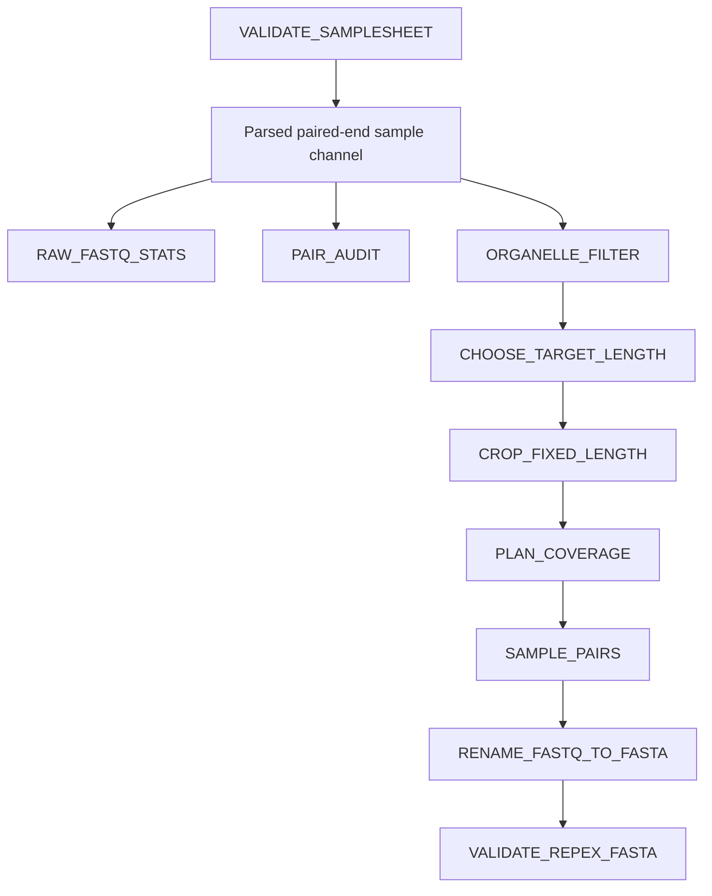

# REPEXPREP Process Inventory

This document defines the technical contract of the active REPEXPREP processes. User-facing installation, execution, input examples, and result descriptions belong in `README.md`.
Pipeline under development (21-07-2026)


## 1. Active execution graph



`RAW_FASTQ_STATS`, `PAIR_AUDIT`, and `ORGANELLE_FILTER` consume the same parsed sample channel and may run in parallel. `PAIR_AUDIT` is therefore a run-level failure gate, not an upstream scheduling gate for organelle filtering.

## 2. Shared channel and metadata contracts

### Parsed sample channel

```groovy
tuple(
    meta,
    [r1_fastq, r2_fastq]
)
```

The active workflow expects the following metadata keys:

```text
id
sample
organism
genome_size_bp
ploidy
organelle_fasta
target_coverage
target_read_length
```

`meta.id` and `meta.sample` derive from the samplesheet `sample` field.


### Validated samplesheet columns

```text
sample,fastq_1,fastq_2,organism,genome_size_bp,ploidy,organelle_fasta,target_coverage,target_read_length
```

Relative `fastq_1` and `fastq_2` paths are resolved to absolute paths by the validator. `organelle_fasta` is preserved as supplied and resolved later by `ORGANELLE_FILTER` when relative.

## 3. Process summary

| ID | Process | Primary output | Emit name | Published location | Role |
|---:|---|---|---|---|---|
| P01 | `VALIDATE_SAMPLESHEET` | `samplesheet.validated.csv` | `validated` | `${params.outdir}/pipeline_info/` | Input gate |
| P02 | `RAW_FASTQ_STATS` | `${meta.id}.raw_fastq_stats.tsv` | `stats` | `${params.outdir}/raw_qc/fastq_stats/` | QC |
| P03 | `PAIR_AUDIT` | `${meta.id}.pair_audit.tsv` | `audit` | `${params.outdir}/raw_qc/pair_audit/` | QC gate |
| P04 | `ORGANELLE_FILTER` | Filtered paired FASTQ and report | `reads`, `report` | `${params.outdir}/organelle_filter/` | Transformation + QC |
| P05 | `CHOOSE_TARGET_LENGTH` | `${sample_id}.target_length.tsv` | `target_length` | `${params.outdir}/length_normalization/target_length/` | Planning |
| P06 | `CROP_FIXED_LENGTH` | Fixed-length paired FASTQ and report | `reads`, `report` | `${params.outdir}/length_normalization/` | Transformation + QC |
| P07 | `PLAN_COVERAGE` | `${sample_id}.coverage_plan.tsv` | `plan` | `${params.outdir}/coverage_sampling/plans/` | Planning |
| P08 | `SAMPLE_PAIRS` | Sampled paired FASTQ and report | `reads`, `report` | `${params.outdir}/coverage_sampling/` | Transformation + QC |
| P09 | `RENAME_FASTQ_TO_FASTA` | RepeatExplorer FASTA and report | `fasta`, `report` | `${params.outdir}/repex/` | Final-data generation |
| P10 | `VALIDATE_REPEX_FASTA` | `${meta.id}.repex_validation.tsv` | `report` | `${params.outdir}/repex/validation/` | Final QC gate |

## 4. Detailed process contracts

### P01. `VALIDATE_SAMPLESHEET`

| Property | Contract |
|---|---|
| Nextflow module | `modules/local/validate_samplesheet/main.nf` |
| Implementation | `bin/validate_samplesheet.py` |
| Process label | `process_low` |
| Input | `path samplesheet` |
| Command | `validate_samplesheet.py --input <samplesheet> --output samplesheet.validated.csv --base-dir ${projectDir}` |
| Output | `path("samplesheet.validated.csv"), emit: validated` |
| Software | Python 3 standard library |
| Output role | Intermediate input contract |

**Required columns:** `sample`, `fastq_1`, `fastq_2`.

**Optional retained columns:** `organism`, `genome_size_bp`, `ploidy`, `organelle_fasta`, `target_coverage`, `target_read_length`.

**Enforced checks:**

- samplesheet exists, is a file, and contains a header and at least one data row;
- sample identifiers are non-empty, unique, and match `^[A-Za-z0-9_.-]+$`;
- R1 and R2 exist, are regular files, and use `.fastq`, `.fq`, `.fastq.gz`, or `.fq.gz`;
- genome size, ploidy, target coverage, and target read length are positive when supplied.

**Known limitations:** FASTQ contents and compression integrity are not inspected; `organelle_fasta` is not validated here; undeclared columns are dropped.

---

### P02. `RAW_FASTQ_STATS`

| Property | Contract |
|---|---|
| Nextflow module | `modules/local/raw_fastq_stats/main.nf` |
| Implementation | `bin/raw_fastq_stats.py` |
| Process label | `process_low` |
| Input | `tuple val(meta), path(reads)` with `reads[0] = R1`, `reads[1] = R2` |
| Command | `raw_fastq_stats.py --sample ${meta.id} --r1 <R1> --r2 <R2> --output ${meta.id}.raw_fastq_stats.tsv` |
| Output | `tuple val(meta), path("${meta.id}.raw_fastq_stats.tsv"), emit: stats` |
| Software | Python 3 standard library |
| Output role | Descriptive QC |

**Report schema:**

```text
sample, mate, file, reads, bases, min_length, max_length,
mean_length, n_bases, gc_bases, gc_percent
```

The process reads both FASTQ files completely and fails on an incomplete four-line FASTQ record. It does not calculate Phred-quality metrics or test R1/R2 pairing.

---

### P03. `PAIR_AUDIT`

| Property | Contract |
|---|---|
| Nextflow module | `modules/local/pair_audit/main.nf` |
| Implementation | `bin/pair_audit.py` |
| Process label | `process_low` |
| Input | `tuple val(meta), path(reads)` |
| Output | `tuple val(meta), path("${meta.id}.pair_audit.tsv"), emit: audit` |
| Software | Python 3 standard library |
| Output role | Paired-read integrity gate |

**Report schema:**

```text
sample, r1_file, r2_file, r1_reads, r2_reads,
compared_pairs, id_mismatches, status
```

`PASS` requires equal record counts, complete FASTQ records, valid `@` headers, and zero normalized-ID mismatches. Terminal `/1` and `/2` suffixes are ignored during ID comparison. Any failed audit exits non-zero.

---

### P04. `ORGANELLE_FILTER`

| Property | Contract |
|---|---|
| Nextflow module | `modules/local/organelle_filter/main.nf` |
| Implementation | Inline Bash |
| Process label | `process_medium` |
| Input | `tuple val(meta), path(reads)` |
| Controls | `meta.organelle_fasta`, `params.skip_organelle_filter` |
| Outputs | `*_R*.organelle_filtered.fastq.gz`, `*.organelle_filter_report.tsv` |
| Emit names | `reads`, `report` |
| Software | Bash, `minimap2`, `samtools`, `gzip`, `zcat`, `awk`, `cp` |
| Output role | Organelle depletion + QC |

**Published files:**

```text
${params.outdir}/organelle_filter/fastq/${meta.id}_R1.organelle_filtered.fastq.gz
${params.outdir}/organelle_filter/fastq/${meta.id}_R2.organelle_filtered.fastq.gz
${params.outdir}/organelle_filter/reports/${meta.id}.organelle_filter_report.tsv
```

**Filtering contract:** `minimap2 -ax sr` aligns paired reads to the organelle reference. `samtools fastq -f 12 -F 2304` retains pairs for which both mates are unmapped and excludes secondary and supplementary alignments.

**Modes:**

| Condition | Behavior | Status |
|---|---|---|
| `skip_organelle_filter = true` | Copy R1/R2 unchanged | `SKIPPED_BY_PARAM` |
| Missing/empty metadata reference | Copy R1/R2 unchanged | `SKIPPED_NO_REFERENCE` |
| Usable reference supplied | Retain both-mates-unmapped pairs | `PASS` |

**Report schema:**

```text
sample, organelle_fasta, status, input_pairs,
kept_pairs, removed_pairs, removed_fraction
```

No BAM file is declared or published. A supplied reference must exist and be non-empty.

---

### P05. `CHOOSE_TARGET_LENGTH`

| Property | Contract |
|---|---|
| Nextflow module | `modules/local/choose_target_length/main.nf` |
| Implementation | `bin/choose_target_length.py` |
| Process label | `process_low` |
| Input | `tuple val(sample_id), val(meta), path(reads)` |
| Control | `meta.target_read_length` |
| Output | `tuple val(sample_id), val(meta), path("${sample_id}.target_length.tsv"), emit: target_length` |
| Software | Python 3 standard library |
| Output role | Read-length planning |

For each pair, the script calculates `min(length(R1), length(R2))`. It uses the per-sample target when supplied; otherwise it selects the script's default 95th percentile.

**Report schema:**

```text
sample, total_pairs, observed_min_pair_length,
observed_max_pair_length, decision_mode, target_length,
pairs_at_or_above_target, retained_fraction
```

The process requires at least one pair and a positive target not greater than the observed maximum pair length.

**Known gap:** global `params.target_read_length` and `params.target_length_percentile` are declared but are not passed to this process.

---

### P06. `CROP_FIXED_LENGTH`

| Property | Contract |
|---|---|
| Nextflow module | `modules/local/crop_fixed_length/main.nf` |
| Implementation | `bin/crop_pairs_to_length.py` |
| Process label | `process_low` |
| Input | `tuple val(meta), path(reads), path(target_length_tsv)` |
| Outputs | `${meta.id}_R*.fixed.fastq.gz`, `${meta.id}.crop_report.tsv` |
| Emit names | `reads`, `report` |
| Software | Python 3 standard library |
| Output role | Fixed-length transformation + QC |

A pair is retained only when both mates are at least the selected target length. Retained sequences and quality strings are right-cropped to exactly that length.

**Report schema:**

```text
sample, target_length, total_pairs, retained_pairs,
dropped_short_pairs, id_mismatches, status
```

`PASS` requires zero ID mismatches and at least one retained pair.

---

### P07. `PLAN_COVERAGE`

| Property | Contract |
|---|---|
| Nextflow module | `modules/local/plan_coverage/main.nf` |
| Implementation | `bin/plan_coverage.py` |
| Process label | `process_low` |
| Input | `tuple val(sample_id), val(meta), path(reads), path(target_length_tsv)` |
| Genome-size precedence | `meta.genome_size_bp` → `params.genome_size_bp` |
| Coverage precedence | `params.target_coverage` → `meta.target_coverage` → `0.2` |
| Output | `tuple val(sample_id), val(meta), path("${sample_id}.coverage_plan.tsv"), emit: plan` |
| Software | Python 3 standard library |
| Output role | Coverage-based sampling plan |

**Formula:**

```text
bases_per_pair = 2 × target_length
requested_pairs = math.ceil((genome_size_bp × target_coverage) / bases_per_pair)
achieved_coverage = (sampled_pairs × bases_per_pair) / genome_size_bp
```

If the requested number exceeds available pairs, all available pairs are retained and the report status is `WARN_INSUFFICIENT_READS_KEEP_ALL`.

**Report schema:**

```text
sample, genome_size_bp, target_coverage, target_length,
bases_per_pair, available_pairs, requested_pairs, sampled_pairs,
planned_bases, achieved_coverage, status
```

**Known gap:** `ploidy` is validated and retained but is not used in the formula.

---

### P08. `SAMPLE_PAIRS`

| Property | Contract |
|---|---|
| Nextflow module | `modules/local/sample_pairs/main.nf` |
| Implementation | `bin/sample_pairs.py` |
| Process label | `process_low` |
| Input | `tuple val(meta), path(reads), path(coverage_plan)` |
| Control | `params.sampling_seed`, default `42` |
| Outputs | `${meta.id}_R*.sampled.fastq.gz`, `${meta.id}.sampling_report.tsv` |
| Emit names | `reads`, `report` |
| Software | Python 3 standard library |
| Output role | Reproducible subsampling + QC |

When fewer than all available pairs are requested, indices are selected without replacement using `random.Random(seed).sample`. The same indices are written to R1 and R2.

**Report schema:**

```text
sample, total_pairs, requested_pairs, selected_indices,
written_pairs, id_mismatches, sampling_mode, seed, status
```

`PASS` requires zero ID mismatches and the expected number of written pairs.

---

### P09. `RENAME_FASTQ_TO_FASTA`

| Property | Contract |
|---|---|
| Nextflow module | `modules/local/rename_convert_fasta/main.nf` |
| Implementation | `bin/rename_fastq_to_fasta.py` |
| Process label | `process_low` |
| Input | `tuple val(meta), path(reads)` |
| Outputs | `${meta.id}.repex.fasta`, `${meta.id}.repex_format_report.tsv` |
| Emit names | `fasta`, `report` |
| Software | Python 3 standard library |
| Output role | Final-data generation + formatting QC |

For every accepted pair, R1 and R2 are written adjacently:

```text
>${sample}_pair000000001_R1
<uppercase R1 sequence>
>${sample}_pair000000001_R2
<uppercase R2 sequence>
```

Pair numbers are one-based and zero-padded to nine digits. Sequence lines are wrapped to 80 characters.

**Report schema:**

```text
sample, r1_file, r2_file, output_fasta, total_pairs,
written_pairs, written_sequences, total_bases, min_length,
max_length, mean_length, id_mismatches, status
```

`PASS` requires at least one written pair and zero ID mismatches. `${meta.id}.repex.fasta` is the principal final data product.

---

### P10. `VALIDATE_REPEX_FASTA`

| Property | Contract |
|---|---|
| Nextflow module | `modules/local/validate_repex_fasta/main.nf` |
| Implementation | `bin/validate_repex_fasta.py` |
| Process label | `process_low` |
| Input | `tuple val(meta), path(fasta)` |
| Output | `tuple val(meta), path("${meta.id}.repex_validation.tsv"), emit: report` |
| Software | Python 3 standard library |
| Output role | Final structural QC gate |

The FASTA must contain a non-zero even number of sequences, unique non-empty headers, non-empty sequences, only `A/C/G/T/N`, and adjacent `_R1`/`_R2` records with matching header roots.

**Report schema:**

```text
sample, input_fasta, total_sequences, total_pairs,
total_bases, min_length, max_length, mean_length,
duplicate_headers, invalid_base_records, empty_sequences,
malformed_pair_headers, status
```

Any failed rule sets `status = FAIL` and exits non-zero.

> **Publication caveat:** P09 publishes the FASTA before P10 validates it. A final FASTA should be treated as accepted only when the corresponding validation report contains `PASS`.

## 5. Workflow-level emitted channels

```text
samples
raw_fastq_stats
pair_audit
organelle_filtered_reads
organelle_filter_reports
target_lengths
normalized_reads
crop_reports
coverage_plans
sampled_reads
sampling_reports
repex_fasta
formatting_reports
validation_reports
```

## 6. Cross-process invariants

A successful accepted sample must satisfy all of the following:

1. one validated samplesheet row exists;
2. R1 and R2 pass `PAIR_AUDIT`;
3. organelle filtering returns `PASS`, `SKIPPED_BY_PARAM`, or `SKIPPED_NO_REFERENCE` as intended;
4. target length is positive;
5. cropping retains at least one pair and reports `PASS`;
6. the coverage plan requests at least one sampled pair;
7. subsampling reports `PASS`;
8. FASTA formatting reports `PASS`;
9. final FASTA validation reports `PASS`.

The accepted final product is:

```text
${params.outdir}/repex/fasta/${sample}.repex.fasta
```

together with:

```text
${params.outdir}/repex/validation/${sample}.repex_validation.tsv
```

containing `status = PASS`.

## 7. Known contract gaps

| Priority | Gap | Required decision |
|---|---|---|
| High | `PAIR_AUDIT` does not gate organelle filtering in the dataflow graph. | Gate transformations on successful audit, or explicitly retain parallel scheduling. |
| High | Active code filters organelles before target-length selection and cropping. | Keep this order and align the README, or intentionally reorder the workflow. |
| Medium | `lane` is expected by the workflow but not emitted by the validator. | Remove it or restore formal multi-lane support. |
| Medium | `params.target_read_length` is unused. | Connect it with explicit precedence or remove it. |
| Medium | `params.target_length_percentile` is unused. | Pass it to the script or remove it. |
| Medium | `ploidy` is unused by coverage planning. | Define genome-size semantics and decide whether ploidy belongs in the formula. |
| Medium | No container or environment contract exists. | Add reproducible software deployment and version capture. |
| Medium | `organelle_fasta` is validated late. | Validate reference existence and basic FASTA structure during input validation. |
| Low | Final FASTA is published before validation. | Publish only accepted FASTA or require the PASS report downstream. |

## 8. Change-control rule

A change to process order, channel shape, metadata keys, samplesheet columns, parameter precedence, output filenames, report schemas, filtering logic, FASTA header format, or success/failure conditions is a pipeline-contract change and should update this file in the same Git commit.
