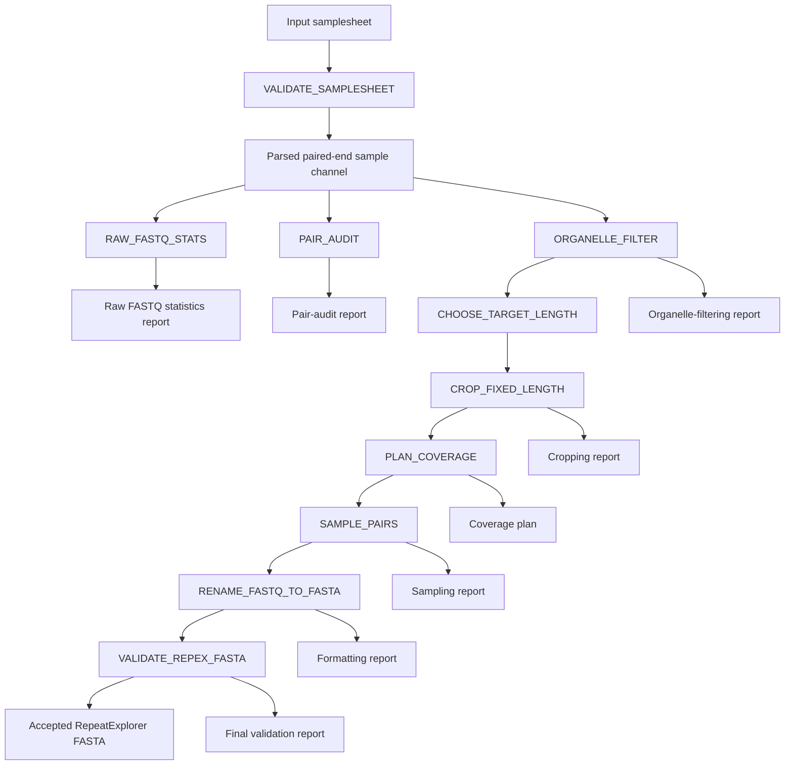
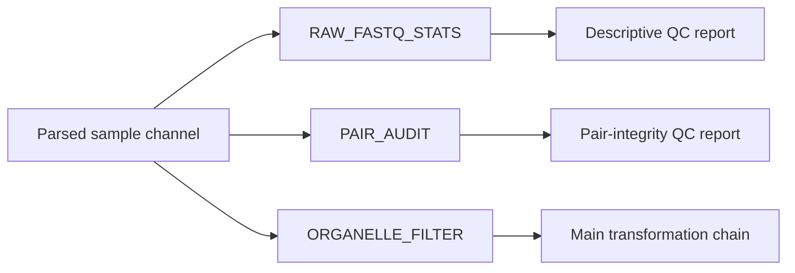

# REPEXPREP workflow map

This document summarizes the active process dependencies, intermediate
files, auxiliary reports, and final-data acceptance path of REPEXPREP.

For detailed process contracts, report schemas, and failure conditions,
see `docs/architecture/process_inventory.md`.

## Main data flow



`RAW_FASTQ_STATS`, `PAIR_AUDIT`, and `ORGANELLE_FILTER` consume the
same parsed sample channel and may run in parallel.

In the current implementation, `PAIR_AUDIT` acts as a run-level QC gate,
but it is not an upstream scheduling dependency of `ORGANELLE_FILTER`.

## Transformation path

The main transformation path is:

```text
Input samplesheet
    ↓
Validated samplesheet
    ↓
Paired-end FASTQ files
    ↓
Organelle-depleted paired FASTQ files
    ↓
Target read-length decision
    ↓
Fixed-length paired FASTQ files
    ↓
Coverage-based sampling plan
    ↓
Subsampled paired FASTQ files
    ↓
Interleaved and renamed RepeatExplorer FASTA
    ↓
Validated RepeatExplorer FASTA
```

Interleaving, read-header renaming, and FASTQ-to-FASTA conversion are
performed together by `RENAME_FASTQ_TO_FASTA`. They are not separate
Nextflow processes.

## Process dependencies

| Order | Process | Direct dependency | Main downstream consumer |
|---:|---|---|---|
| 1 | `VALIDATE_SAMPLESHEET` | Input samplesheet | Workflow samplesheet parser |
| 2 | `RAW_FASTQ_STATS` | Parsed paired-end sample channel | No downstream data consumer |
| 3 | `PAIR_AUDIT` | Parsed paired-end sample channel | Run-level QC evaluation |
| 4 | `ORGANELLE_FILTER` | Parsed paired-end sample channel | `CHOOSE_TARGET_LENGTH` |
| 5 | `CHOOSE_TARGET_LENGTH` | Organelle-filtered reads | `CROP_FIXED_LENGTH` |
| 6 | `CROP_FIXED_LENGTH` | Filtered reads and target-length table | `PLAN_COVERAGE` |
| 7 | `PLAN_COVERAGE` | Fixed-length reads and target-length table | `SAMPLE_PAIRS` |
| 8 | `SAMPLE_PAIRS` | Fixed-length reads and coverage plan | `RENAME_FASTQ_TO_FASTA` |
| 9 | `RENAME_FASTQ_TO_FASTA` | Subsampled paired reads | `VALIDATE_REPEX_FASTA` |
| 10 | `VALIDATE_REPEX_FASTA` | RepeatExplorer-compatible FASTA | Final acceptance decision |

## Auxiliary outputs

- Validated samplesheet:
  `pipeline_info/samplesheet.validated.csv`
- Raw FASTQ statistics:
  `raw_qc/fastq_stats/*.raw_fastq_stats.tsv`
- FASTQ pair-audit metrics:
  `raw_qc/pair_audit/*.pair_audit.tsv`
- Organelle-filtering statistics:
  `organelle_filter/reports/*.organelle_filter_report.tsv`
- Target read-length decisions:
  `length_normalization/target_length/*.target_length.tsv`
- Read-cropping statistics:
  `length_normalization/reports/*.crop_report.tsv`
- Coverage and subsampling plans:
  `coverage_sampling/plans/*.coverage_plan.tsv`
- Paired-read sampling statistics:
  `coverage_sampling/reports/*.sampling_report.tsv`
- RepeatExplorer formatting reports:
  `repex/reports/*.repex_format_report.tsv`
- Final FASTA validation reports:
  `repex/validation/*.repex_validation.tsv`
- Software-version records:
  stored in the baseline documentation; not currently emitted by an
  active workflow process
- Final output manifest:
  planned, but not currently generated by an active workflow process

## Intermediate files

| Producer | Intermediate file | Consumer | Published? |
|---|---|---|---|
| `VALIDATE_SAMPLESHEET` | `samplesheet.validated.csv` | Workflow samplesheet parser | Yes |
| `ORGANELLE_FILTER` | `${meta.id}_R1.organelle_filtered.fastq.gz` and `${meta.id}_R2.organelle_filtered.fastq.gz` | `CHOOSE_TARGET_LENGTH` | Yes |
| `CHOOSE_TARGET_LENGTH` | `${sample_id}.target_length.tsv` | `CROP_FIXED_LENGTH` and `PLAN_COVERAGE` | Yes |
| `CROP_FIXED_LENGTH` | `${meta.id}_R1.fixed.fastq.gz` and `${meta.id}_R2.fixed.fastq.gz` | `PLAN_COVERAGE` and `SAMPLE_PAIRS` | Yes |
| `PLAN_COVERAGE` | `${sample_id}.coverage_plan.tsv` | `SAMPLE_PAIRS` | Yes |
| `SAMPLE_PAIRS` | `${meta.id}_R1.sampled.fastq.gz` and `${meta.id}_R2.sampled.fastq.gz` | `RENAME_FASTQ_TO_FASTA` | Yes |
| `RENAME_FASTQ_TO_FASTA` | `${meta.id}.repex.fasta` | `VALIDATE_REPEX_FASTA` | Yes |

Although these files are intermediate within the workflow, the current
modules publish them to the selected output directory for inspection,
debugging, and baseline comparison.

## QC-only outputs

| Producer | QC output | Downstream data consumer |
|---|---|---|
| `RAW_FASTQ_STATS` | `${meta.id}.raw_fastq_stats.tsv` | None |
| `PAIR_AUDIT` | `${meta.id}.pair_audit.tsv` | None |
| `ORGANELLE_FILTER` | `${meta.id}.organelle_filter_report.tsv` | None |
| `CROP_FIXED_LENGTH` | `${meta.id}.crop_report.tsv` | None |
| `SAMPLE_PAIRS` | `${meta.id}.sampling_report.tsv` | None |
| `RENAME_FASTQ_TO_FASTA` | `${meta.id}.repex_format_report.tsv` | None |
| `VALIDATE_REPEX_FASTA` | `${meta.id}.repex_validation.tsv` | Final acceptance decision |

## Final-output acceptance

The principal final data product is:

```text
${params.outdir}/repex/fasta/${sample}.repex.fasta
```

The FASTA is accepted as a valid pipeline result only when the
corresponding report exists:

```text
${params.outdir}/repex/validation/${sample}.repex_validation.tsv
```

and contains:

```text
status = PASS
```

The FASTA file is currently published by `RENAME_FASTQ_TO_FASTA` before
`VALIDATE_REPEX_FASTA` finishes. Therefore, file existence alone does
not prove successful final validation.

## Parallel execution notes

The following processes may begin independently after samplesheet
parsing:

```text
RAW_FASTQ_STATS
PAIR_AUDIT
ORGANELLE_FILTER
```

Their scheduling relationship can be represented as:



This means that an organelle-filtering task may be submitted before the
corresponding pair audit has completed. Changing this behavior would
require an explicit dataflow dependency between `PAIR_AUDIT` and the
transformation chain.